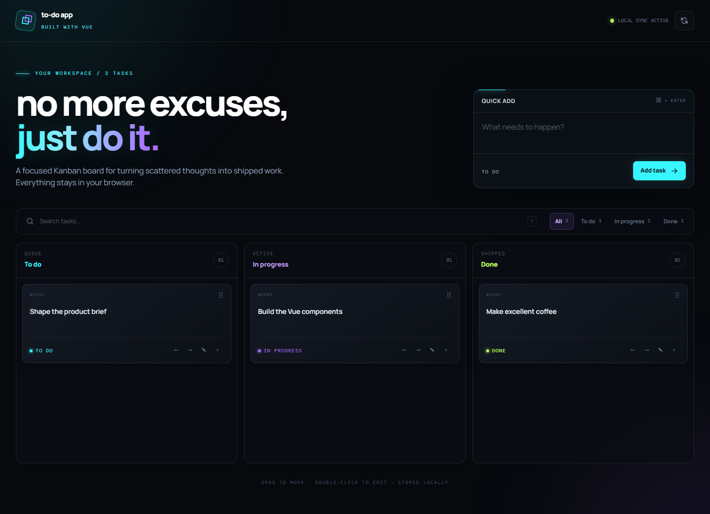
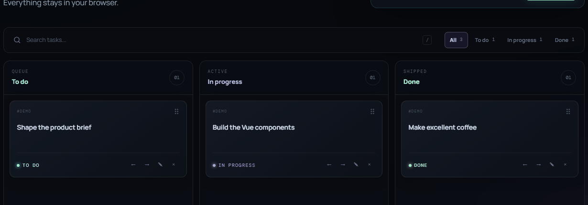

# Vue Task Board


A fast, local-first Kanban board for turning scattered thoughts into shipped work. Built with
Vue 3, Pinia and Tailwind CSS.

[**Open the live demo →**](https://pierrelaguerre.github.io/to-do-app/)



## What it does

- Creates, edits, deletes and restores tasks without requiring an account
- Moves and reorders work across **To do**, **In progress** and **Done**
- Supports drag-and-drop as well as explicit keyboard and mobile controls
- Searches and filters the board with live status counters
- Persists every change in versioned browser storage
- Recovers gracefully when saved local data is invalid or unavailable
- Adapts from a three-column desktop board to a focused mobile flow
- Respects visible focus states and reduced-motion preferences



## Tech stack

- **Vue 3** with Composition API and `<script setup>`
- **Pinia** for predictable task state and derived data
- **Tailwind CSS 4** plus a small custom visual system
- **Vite 8** for development and production builds
- **Vitest + Vue Test Utils** for store and component tests
- **Playwright** for desktop and mobile smoke tests
- **GitHub Actions** for CI and GitHub Pages deployment

The app is intentionally frontend-only. Its small versioned persistence layer lives in
`src/store/task.js`; it validates stored records, restores demo content on failure and keeps the UI
usable even if browser storage cannot be written.

## Run locally

Requires Node.js 20.19 or newer.

```bash
npm install
npm run dev
```

Quality checks:

```bash
npm run lint
npm test
npm run test:e2e
npm run build
```

## From bootcamp project to portfolio project

This repository started as my final Vue.js bootcamp project in 2023. The original version proved
the core idea with Vue, Pinia, Tailwind and Supabase, but it still carried template documentation,
experimental reactivity, incomplete task interactions and an account wall in front of the demo.

For the portfolio edition I kept the original Git history and rebuilt the experience around a
clearer frontend goal: let anyone understand and use the product immediately. The renovation
removed the abandoned backend dependency, introduced a resilient local data model, completed the
Kanban interactions, added accessible alternatives to drag-and-drop, and placed the project behind
automated tests and deployment.

That evolution is part of the project: it shows not only what I learned during the bootcamp, but
how I now review old decisions, reduce unnecessary complexity and bring a product to a presentable
standard.

## Design notes

The interface is dark-only by design. Cyan, violet and acid-lime accents identify actions and board
states, while glow is reserved for focus and movement feedback. The restrained palette, large type
and generous negative space keep the UI readable instead of turning the neon treatment into visual
noise.

---

Designed and built by [Pierangelo Guerrero](https://github.com/PierreLaGuerre).
